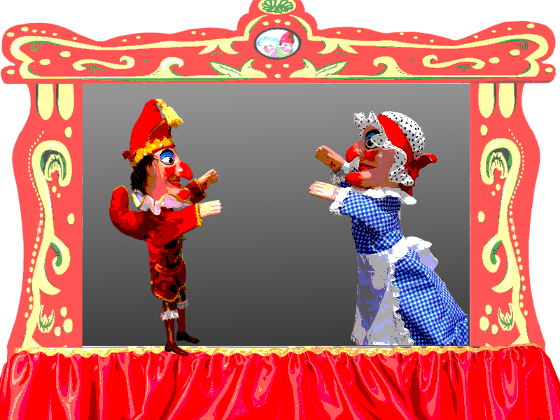

# Automatically generating interactive, non-linear stories

Entertainment has changed a lot over the last couple of centuries. We went from books and plays to radio, films and TV. A big use of these media was for fiction – telling a story. But although the media changed greatly, the stories were mostly of the same format: totally linear and non-interactive.

Even though computer games are a fully-interactive medium, their stories are either entirely pre-scripted (with perhaps one or two branches), or entirely generated by a player's interactions with the game. The problem with the former is that the player has no power over the flow or content of the story. The latter leads to "stories" that have no structure or emotional power. Some kind of happy middle ground needs to be found.

In this research, we are starting small by creating a generative version of the Punch and Judy puppet show. The idea is that the characters are modelled by agents, so that their behaviours remain consistent, even though the story will change every time the program is run. On top of all of this, we have an ontology for narrative that ensures that the generated tales are emotionally satisfying and entertaining.
